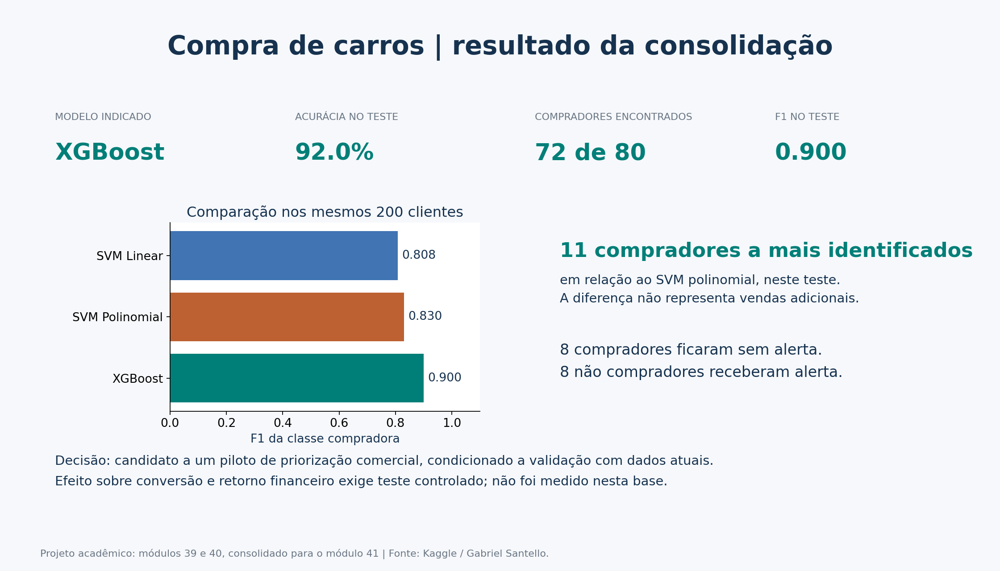
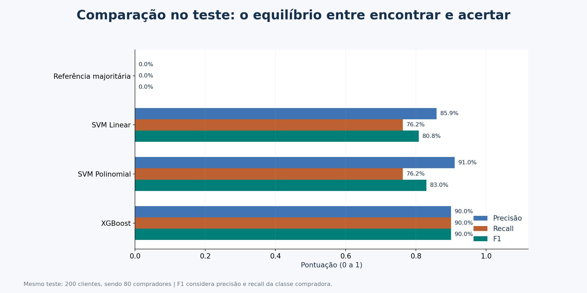

# Compra de carros: XGBoost e SVM para priorização comercial

**Marlon Nascimento · Projeto de Parceria EBAC / Semantix · Módulo 41**

Consolidação dos exercícios dos módulos 39 e 40, com dados públicos, análise exploratória, comparação de modelos e comunicação dos resultados. O problema é identificar perfis associados à compra de carros para apoiar a priorização de contatos comerciais.



**Escopo da publicação:** por escolha do autor, o GitHub contém apenas código, documentação e resultados agregados. O CSV, previsões por cliente, partições por identificador e exemplos individuais nos notebooks ficam fora da publicação. A EDA apresenta faixas de idade; a base pública pode ser obtida localmente pelo script de coleta.

Na execução consolidada, o XGBoost identificou **72 dos 80 compradores** do teste, com **92,0% de acurácia e F1 de 0,900**. Os SVMs identificaram 61 compradores. Esses números medem classificação de registros históricos; não representam vendas adicionais nem retorno financeiro comprovado.

## Coleta de dados

Utiliza-se a base **Cars - Purchase Decision Dataset**, publicada por Gabriel Santello no [Kaggle](https://www.kaggle.com/datasets/gabrielsantello/cars-purchase-decision-dataset), com licença **CC0: Public Domain**, confirmada nos metadados da API pública em 30/09/2026. São 1.000 registros e cinco colunas: identificador, gênero, idade, renda anual e indicador de compra. A base não inclui nomes ou contatos. O método original de coleta, a moeda e o período das observações não estão documentados no material verificado; os valores não são apresentados como reais brasileiros.

A cópia pública reproduz as dimensões, as primeiras linhas e as correlações salvas no exercício M40. O arquivo original utilizado pelo curso não estava na pasta, portanto não é possível comparar seu hash com o da cópia recuperada. A descrição, licença, rastreabilidade e dicionário estão em [data/README.md](data/README.md).

## Modelagem

O problema é de classificação binária: `Purchased = 1` significa compra registrada. O identificador é excluído. Gênero recebe o mapeamento fixo do exercício; idade e renda mantêm os valores originais. Os SVMs usam padronização em `Pipeline`, ajustada apenas no treino de cada partição.

A divisão estratificada mantém **800 clientes no treino e 200 no teste**, com `random_state=42`. Os modelos do M40 são preservados: SVM linear, SVM polinomial e XGBoost. Acrescentam-se uma referência majoritária e validação cruzada estratificada com cinco partições **apenas no treino**, sem otimização de hiperparâmetros. O maior F1 médio nessa validação indica o candidato; o teste comunica sua performance e os erros dos concorrentes.

| Modelo | Acurácia | Precisão | Recall | F1 | ROC-AUC |
|---|---:|---:|---:|---:|---:|
| Referência majoritária | 0,6000 | 0,0000 | 0,0000 | 0,0000 | 0,5000 |
| SVM linear | 0,8550 | 0,8592 | 0,7625 | 0,8079 | 0,9239 |
| SVM polinomial | 0,8750 | 0,9104 | 0,7625 | 0,8299 | 0,9310 |
| **XGBoost** | **0,9200** | **0,9000** | **0,9000** | **0,9000** | **0,9662** |

Precisão, recall e F1 referem-se à classe compradora. O SVM polinomial mantém a maior precisão, mas perde mais compradores. A documentação completa registra configurações, avaliação, limitações e a diferença em relação ao notebook histórico, que traz 91,5% de acurácia para XGBoost.



## Conclusões

O XGBoost é o candidato indicado para um piloto: obteve o maior F1 médio na validação do treino (0,8864; desvio-padrão entre partições de 0,0403). No teste, classificou corretamente 184 clientes, deixou oito compradores sem identificação e incluiu oito não compradores na seleção.

Um piloto deve medir conversão e margem com um grupo de controle antes de atribuir benefício à priorização. A base é pequena e tem perfis repetidos, poucos atributos e origem amostral insuficientemente descrita. A divisão aleatória não testa estabilidade temporal, e o teste histórico já foi utilizado no exercício anterior. Estes resultados não equivalem a uma validação independente para produção.

Leia a [documentação completa](docs/PROJETO.md) e o [guia de entrega](docs/ENTREGA.md).

## Reproduzir

Recomendado: Python 3.12. Na raiz deste repositório:

```bash
python -m venv .venv
# Windows:
.venv\Scripts\activate
# macOS/Linux:
# source .venv/bin/activate
python -m pip install -r requirements.txt
python src/baixar_dados.py
python src/analise.py
```

O primeiro comando obtém a base pública localmente e confere seu hash. O segundo verifica o esquema dos dados e regenera métricas, partições, previsões e cinco figuras. Para leitura e execução por etapas, use [o notebook consolidado](notebooks/Projeto_Semantix.ipynb). As versões efetivamente usadas estão em `reports/resultados.json`; o ambiente completo está fixado em `requirements-lock.txt`.

## Organização

```text
data/                  Licença, fonte e dicionário; CSV obtido localmente
src/analise.py         Preparação, validação, modelagem e figuras reproduzíveis
notebooks/             Notebook consolidado e exercícios anteriores preservados
reports/               Métricas, previsões, partições, auditoria e figuras
docs/                  Documentação completa e guia de entrega
entrega_imagens/       Imagens selecionadas para a plataforma
```

Projeto acadêmico. A identificação EBAC / Semantix informa o contexto da atividade e não implica validação comercial por essas empresas.
