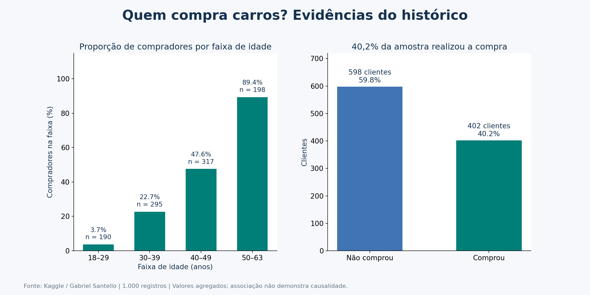
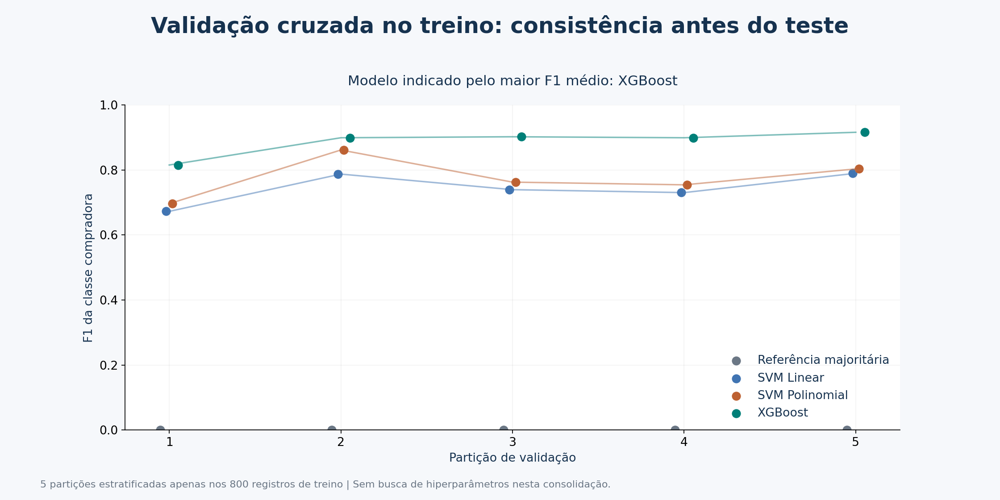
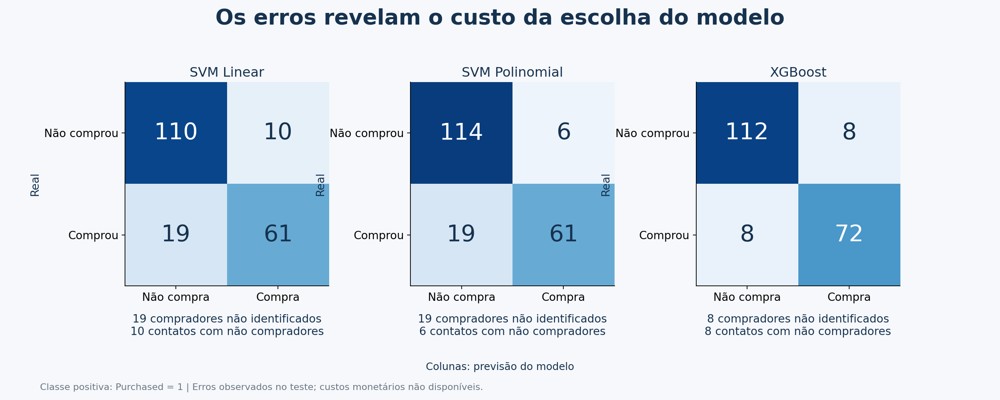

# Projeto de Parceria: classificação de compradores de carros

**Autor:** Marlon Nascimento  
**Contexto:** consolidação dos módulos 39 e 40 para o módulo 41, EBAC / Semantix.  
**Data da execução:** 30/09/2026.

## Coleta de dados

### Problema de negócio e justificativa

Um time comercial tem capacidade limitada de contatar potenciais clientes. Priorizar perfis associados à compra pode ajudar a organizar a abordagem. O objetivo técnico é comparar a capacidade de três classificadores já estudados de distinguir compradores e não compradores a partir de idade, renda e gênero.

Machine Learning é pertinente para comparar uma fronteira linear com padrões não lineares e interações entre atributos. A utilidade operacional permanece uma hipótese: o alvo registra uma compra histórica e não especifica horizonte futuro ou efeito de campanhas. O trabalho avalia classificação, não prova incremento de vendas.

### Origem, disponibilidade e licença

A fonte é [Cars - Purchase Decision Dataset, de Gabriel Santello no Kaggle](https://www.kaggle.com/datasets/gabrielsantello/cars-purchase-decision-dataset). O download é público e os metadados da API declaram **CC0: Public Domain**. A declaração da licença, versão e link foram registrados em [fonte.json](../data/fonte.json). O [dicionário](../data/README.md) explica os cinco campos e o hash do arquivo usado.

O CSV do exercício não estava na pasta. Recuperou-se a base pública que coincide com as 1.000 linhas, cinco colunas, primeiras linhas e correlações salvas no M40. Essa evidência sustenta a correspondência, mas não substitui a comparação integral de hashes com o arquivo do curso. A publicação foi atualizada em julho de 2022; moeda, país, período de observação e método de coleta não foram confirmados. Não atribuímos os registros a clientes da Semantix.

### Qualidade e análise exploratória

- 1.000 linhas, 1.000 identificadores distintos; zero valores ausentes e zero duplicados completos.
- 598 não compradores (59,8%) e 402 compradores (40,2%). Uma referência majoritária acerta 60% no teste, mas não encontra comprador algum.
- Idade entre 18 e 63 anos; renda anual entre 15.000 e 152.500 unidades da fonte. Não há motivo documentado para cortar valores extremos válidos.
- Correlação de Pearson com a compra: idade **0,6160**, renda **0,3650** e gênero codificado **-0,0472**. Associação não demonstra causalidade nem permite descartar efeitos não lineares.
- Existem 57 repetições de perfil sem o identificador. São preservadas na consolidação histórica; a independência dessas observações não é confirmada pela fonte. Dos 200 registros de teste, 21 têm atributos preditores idênticos aos de algum registro de treino, apesar de IDs distintos. Isso limita a independência dos perfis avaliados.

A visualização apresenta a proporção de compradores por faixa de idade, sem expor registros individuais. O gráfico de classes contextualiza a avaliação: é preciso encontrar compradores, além de acertar a classe mais frequente. As correlações e estatísticas são exportadas em `reports/`, sem usá-las para selecionar variáveis ou hiperparâmetros após observar o teste.

## Modelagem

### Continuidade do trabalho anterior

Os notebooks originais foram preservados em `notebooks/originais/`. O M39 define um XGBoost com 100 árvores e taxa de aprendizado 0,10, mas não possui saídas salvas. O M40 traz comparação executada entre SVM linear, SVM polinomial e XGBoost com **150 árvores e taxa 0,05**. A consolidação reproduz a configuração do M40. Corrige-se, portanto, a afirmação do M40 de que sua configuração seria idêntica à do M39.

Não foram adicionados PCA, K-means ou regressão por obrigação de cobrir nomes de técnicas: a pergunta escolhida é uma classificação supervisionada com três atributos. A resposta da tutoria orienta aproveitar um trabalho anterior; não exige aplicar todas as técnicas simultaneamente. A validação cruzada e a referência majoritária complementam a avaliação dos modelos existentes.

### Preparação e prevenção de vazamento

`User ID` não é preditor. `Purchased` fica separado como alvo. O mapeamento fixo de gênero é `Female=0`, `Male=1`; não estima estatísticas do teste. Nenhuma linha foi removida ou imputada, pois a base verificada está completa.

A divisão estratificada usa 80% para treino e 20% para teste, com `random_state=42`: são 800 e 200 registros, respectivamente. O teste contém 120 não compradores e 80 compradores. Seus identificadores estão separados dos identificadores do treino.

Nos SVMs, o `StandardScaler` é parte do `Pipeline`. Em cada fold da validação, média e desvio são ajustados apenas nas observações de treinamento desse fold. O XGBoost recebe as variáveis em escala original, seguindo o exercício e dispensando padronização para divisões de árvores. A organização segue as [orientações de prevenção de vazamento do scikit-learn](https://scikit-learn.org/stable/common_pitfalls.html).

Esta proteção contra vazamento de pré-processamento não resolve a incerteza sobre perfis repetidos ou sobre a disponibilidade temporal dos atributos. A base também não permite uma validação por período.

### Modelos e configurações

| Modelo | Configuração preservada / adicionada | Justificativa |
|---|---|---|
| Referência majoritária | `DummyClassifier(strategy='most_frequent')` | Mede o desempenho trivial e evita avaliar apenas acurácia. |
| SVM linear | `C=1`, `kernel='linear'`, `probability=True`, `random_state=1` | Referência com fronteira linear e entradas padronizadas. |
| SVM polinomial | `C=1`, `degree=3`, `gamma='scale'`, `coef0=0`, `probability=True`, `random_state=1` | Captura interações não lineares; explicita os padrões do exercício. |
| XGBoost | 150 árvores, profundidade 3, taxa 0,05, `subsample=0.90`, `colsample_bytree=0.90`, `random_state=42` | Combina árvores por boosting e captura padrões não lineares. |

O XGBoost usa `objective='binary:logistic'`, `eval_metric='logloss'` e um trabalhador para execução estável. Os parâmetros são fixos; **não houve busca ou otimização de hiperparâmetros nesta entrega**. Não se afirma que sejam ótimos. As classes dos SVMs vêm de `predict`; a estimativa de probabilidade calibrada do SVC é usada para ROC-AUC e não é substituída por um corte de 0,5. O XGBoost mantém o limiar padrão da classificação.

### Validação cruzada e escolha

Usou-se `StratifiedKFold(n_splits=5, shuffle=True, random_state=42)` nos 800 registros de treino. O critério declarado da consolidação é **F1 da classe compradora**, por equilibrar precisão e recall sem depender somente dos acertos da classe majoritária. O custo de contato e o custo de perder um comprador não estão disponíveis; logo, F1 é uma referência técnica e não uma otimização financeira.

| Modelo | F1 médio no treino por CV | Desvio-padrão entre folds |
|---|---:|---:|
| Referência majoritária | 0,0000 | 0,0000 |
| SVM linear | 0,7440 | 0,0482 |
| SVM polinomial | 0,7757 | 0,0613 |
| **XGBoost** | **0,8864** | **0,0403** |

O desvio-padrão é a dispersão entre folds, não um intervalo de confiança. O XGBoost é indicado pela maior média no treino. Não foi realizado teste estatístico de superioridade.

### Avaliação no teste e leitura dos erros

| Modelo | Acurácia | Precisão | Recall | F1 | ROC-AUC | Acurácia balanceada |
|---|---:|---:|---:|---:|---:|---:|
| Referência majoritária | 0,6000 | 0,0000 | 0,0000 | 0,0000 | 0,5000 | 0,5000 |
| SVM linear | 0,8550 | 0,8592 | 0,7625 | 0,8079 | 0,9239 | 0,8396 |
| SVM polinomial | 0,8750 | 0,9104 | 0,7625 | 0,8299 | 0,9310 | 0,8562 |
| **XGBoost** | **0,9200** | **0,9000** | **0,9000** | **0,9000** | **0,9662** | **0,9167** |

Precisão = proporção de compradores entre os alertas de compra; recall = proporção de compradores identificados; F1 = média harmônica entre precisão e recall. ROC-AUC avalia ordenação dos escores; não prova calibração das probabilidades. Acurácia balanceada dá o mesmo peso ao recall das duas classes.

O XGBoost encontrou 72 compradores, perdeu oito e selecionou oito não compradores. O SVM polinomial encontrou 61 compradores, perdeu 19 e selecionou seis não compradores. O XGBoost encontra **11 compradores a mais ao custo de dois contatos adicionais com não compradores**, neste teste. Quando contatos são muito caros, a maior precisão do SVM polinomial pode merecer consideração, mas é necessário medir os custos.

### Auditoria dos resultados anteriores

O M40 registra para XGBoost acurácia **0,9150**, precisão **0,8889**, recall **0,9000**, F1 **0,8944** e ROC-AUC **0,9666**. A execução consolidada obtém **0,9200**, **0,9000**, **0,9000**, **0,9000** e **0,9662**, respectivamente. Os resultados dos SVMs coincidem a quatro casas decimais.

O notebook antigo não registra as versões de suas bibliotecas; o CSV original também não estava presente. Portanto, não se afirma uma causa comprovada para a diferença. Mantemos o notebook original e os resultados históricos no JSON de auditoria. As visualizações desta entrega usam exclusivamente a nova execução, cujas versões e dados estão registrados e fixados.

O mesmo teste já havia sido usado no exercício M40 e seus resultados eram conhecidos antes da consolidação. A nova validação cruzada organiza melhor a escolha, mas não transforma esse teste histórico em um conjunto final independente. Uma implantação precisa de dados adicionais.

## Conclusões

### Resultado técnico e decisão de negócio

O XGBoost foi o melhor candidato entre as configurações comparadas tanto no F1 médio da validação do treino quanto no F1 do teste histórico. Isso é compatível com a hipótese de padrões não lineares em idade e renda, mas não constitui prova de que o algoritmo será superior em toda população.

A recomendação é **testar a priorização comercial em um piloto**, após validação com clientes atuais e definição de uma janela futura de compra. A classificação não deve ser tratada como garantia de compra individual nem como efeito causal de uma campanha. Um grupo de controle deve permitir medir conversão, receita, margem após custos e possíveis diferenças de cobertura por perfil.

### Limitações

1. Amostra pequena, sem documentação suficiente sobre origem, período, moeda e representatividade. O objetivo de negócio é real, mas a autenticidade operacional de cada registro não é demonstrada pela publicação.
2. Perfis repetidos podem tornar a divisão aleatória mais favorável. Não se comprovou independência entre esses perfis. Uma avaliação agrupada por perfil e uma base temporal externa são próximos passos, não resultados já executados.
3. Há somente três atributos; faltam interações comerciais, origem do lead, interesse no produto e informações temporais. Gênero foi mantido para reproduzir o exercício; sua necessidade deve ser testada antes de uso operacional.
4. Hiperparâmetros fixos, sem busca, calibração externa, otimização do limiar ou teste estatístico de superioridade.
5. O teste é histórico e conhecido. Nenhum retorno financeiro, incremento de vendas ou desempenho em produção foi medido.

### Reprodutibilidade e entrega

O script usa caminhos relativos à própria raiz do projeto e inclui checagens do esquema, dos nulos e dos identificadores. Exporta métricas por fold, métricas do teste, partições por ID, previsões, hash e versões. O notebook consolidado oferece leitura guiada e os originais preservam o vínculo com o trabalho anterior. As dependências e instruções estão no README.

A documentação cobre os três tópicos obrigatórios e as imagens contam a sequência **problema → dados → comparação → erros → decisão e limites**. O [guia de entrega](ENTREGA.md) registra a etapa de publicação e os prints necessários para a plataforma.

### Referências

- Gabriel Santello. [Cars - Purchase Decision Dataset](https://www.kaggle.com/datasets/gabrielsantello/cars-purchase-decision-dataset). Kaggle. Metadados consultados em 30/09/2026.
- Scikit-learn. [Common pitfalls and recommended practices](https://scikit-learn.org/stable/common_pitfalls.html).
- Scikit-learn. [Cross-validation: evaluating estimator performance](https://scikit-learn.org/stable/modules/cross_validation.html).
- XGBoost. [Parâmetros dos modelos](https://xgboost.readthedocs.io/en/stable/parameter.html).
- Exercícios M39 e M40 preservados em `notebooks/originais/`; orientação da tutoria fornecida pelo autor na conversa.

### Escopo público escolhido pelo autor

Esta publicação contém apenas código, documentação e resultados agregados. Não inclui o CSV bruto, previsões individuais ou partições identificadas por cliente. Os notebooks anteriores mantêm seu código e análises em Markdown, com saídas removidas para evitar exemplos individuais. O notebook consolidado foi executado com saídas agregadas e gráficos por faixas, sem amostras de registros. Os arquivos por cliente que o script gera ficam somente no ambiente local e são ignorados pelo Git.

Para reproduzir, obtenha a base pública com `python src/baixar_dados.py` antes de executar `python src/analise.py`. O script de coleta verifica o hash registrado em `data/fonte.json`.
